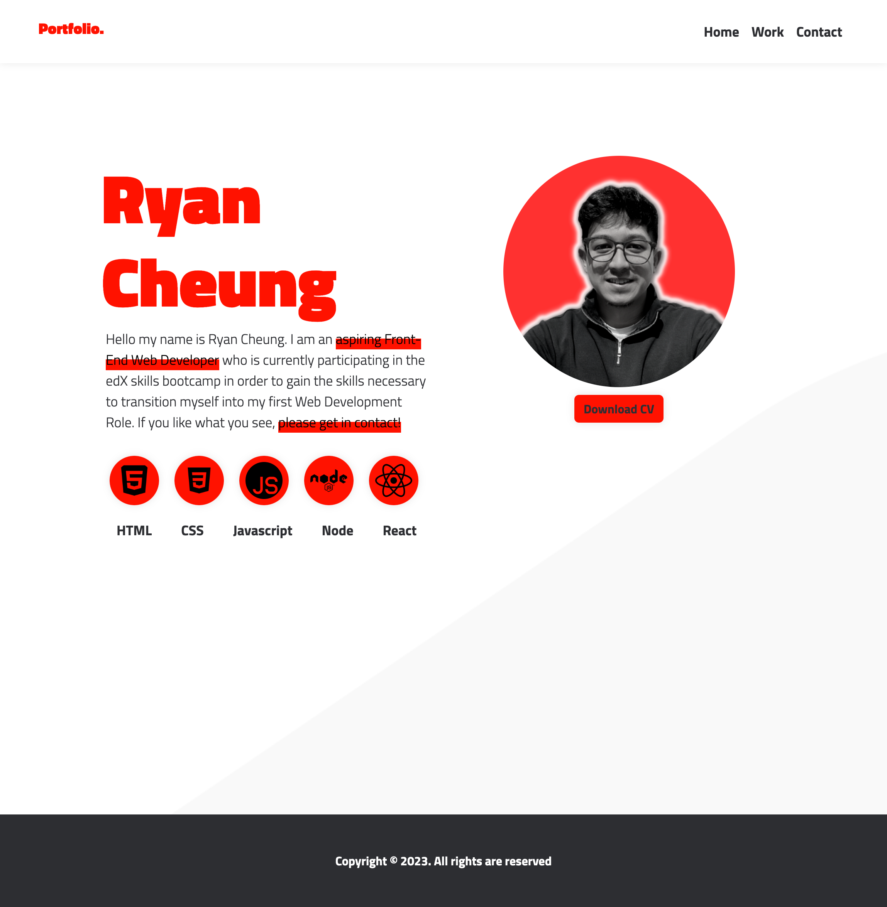
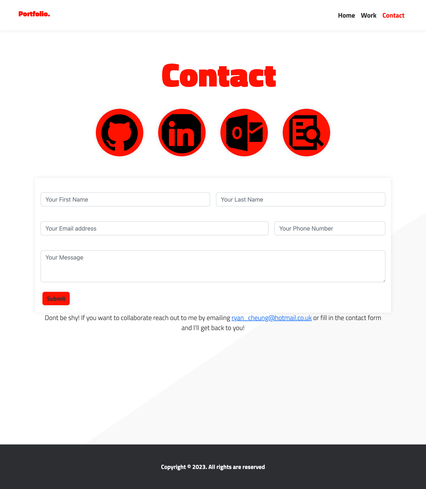

# Portfolio Made with React.

This assignment was created to allow me to implement all of the knowledge and skills that I have acrrued over the course of the bootcamp to develop the foundations of my personal portfolio. This portfolio is a work in progress and will be further developed down the road as my skills and knowledge increase!

To hit the requirements of the challenge I had to ensure the following;

## Design
* Use mobile-first design.

* Choose a color palette for your site so it doesn't just look like the default bootstrap theme or an unstyled HTML site.

* Make sure the font size is large enough to read and that the colors don't cause eye strain.

## Base Requirements

### The following technologies must be used:

* React

* Navigation using React Router, dynamic rendering, or another third part router

## Your portfolio must contain the following information:

* Your name

### Links to your:

* GitHub profile

* LinkedIn page

* Email address

* CV (in PDF format)

* Your CV must contain up-to-date projects and professional experience
 A list of projects (Challenges or Projects). For each project, make sure you have the following:

* Project title

* Link to the deployed version

* Link to the GitHub repository

* GIF or screenshot of the deployed application

## Required Components

At a minimum, your portfolio must render these 6 components:

* App

* Header

* Home page

* Projects page

* Project (on Projects page)

* Contact page

## Component Content and Requirements

### Each of the following components must follow these guidelines:

## App:

* Must be your top-level component and render all necessary child components

## Header:

* Must be rendered across every page component of the site

* Must contain a Navbar

## Home page:

### This should be a welcome landing page that contains:

* Your Name

* A headshot of you (or an avatar)

* Your brand statement

* Some indication that this is your portfolio site

## Projects page:

* Must render six instances of the Project component dynamically

* Be sure to store your project details data in a JSON file and import it into your project

## Project:

* Must be a reusable component that ingests JSON data as props and renders a single instance for each project

* Must utilize Router props to properly render the right project based on user selection

* Must render the following info:

* Project title

* Link to the deployed version

* Link to the GitHub repository

* GIF or screenshot of the deployed application

## Contact page:

### Must include contact information:

* Email address

* Link to a PDF version of your CV

* Link to your GitHub profile

* Link to your LinkedIn page

* Must have a contact form for handling events

## Updated Social Media Presence

* A good portfolio includes updated skills information and links to your web presence. You should update the following social media accounts as well:

## LinkedIn

* Make sure to update your LinkedIn Profile with the new skills you've acquired since the last time it was updated.

* If you do not have a LinkedIn profile, please create one.

* Update your GitHub profile with pinned repositories featuring those same projects.

## Portfolio Preview

